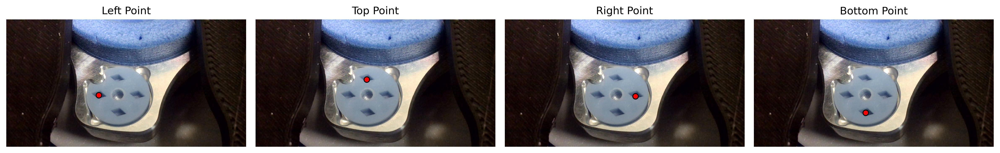
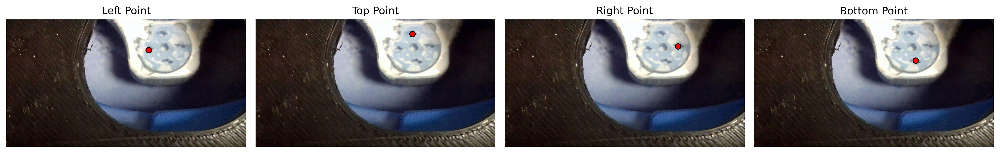

# CryogridNet

A series of neural networks that automatically detect the center coordinates of each slot in a grid box used for CRYO-EM protein freezing. Provided are U-Net models with a MobileNetV2 or DenseNet121 pretrained encoder to predict four slot centers via heatmap regression.

## Installation

If you already have PyTorch with the correct CUDA version installed, simply run:

```bash
pip install -r requirements.txt
```

If you need to install the CUDA 12.4–compatible PyTorch wheels first, run:

```bash
pip install torch==2.6.0+cu124 torchvision==0.21.0+cu124 --extra-index-url https://download.pytorch.org/whl/cu124
pip install -r requirements.txt
```

Alternatively, you can install everything in one command:

```bash
pip install -r requirements.txt --extra-index-url https://download.pytorch.org/whl/cu124
```

## Usage

```bash
python train.py --model mobilenet_v2    # Train with MobileNetV2 backbone
python train.py --model densenet121     # Train with DenseNet121 backbone
python test.py --model mobilenet_v2     # Test with MobileNetV2 backbone
python test.py --model densenet121      # Test with DenseNet121 backbone
```

## Overview

This model automates slot center detection in grid boxes for cryo-electron microscopy (CRYO-EM) protein sample preparation. While showing promising results, the project was pivoted to a hardware-based pipeline solution.

## Model Architecture

- **Backbone Options**: MobileNetV2 or DenseNet121 encoder
- **Architecture**: U-Net decoder for spatial localization
- **Output**: 4-channel heatmap prediction (one per slot center)
- **Input**: RGB images resized to 960×512 pixels
- **Detection**: Rhombus-shaped heatmaps for robust center prediction
- **Available on**: [HuggingFace Models](https://huggingface.co/galactixx/gridbox-net)

## Dataset

- **Images**: Grid box photographs with varying conditions
- **Annotations**: CSV with slot center coordinates (X, Y) for each slot type (L, T, R, B)
- **Format**: Each image contains 4 slot center annotations
- **Split**: Train/validation/test based on grid box positions
- **Available on**: [HuggingFace Datasets](https://huggingface.co/datasets/galactixx/cryogrid-boxes)

```
Position,File,Slot,X,Y
position-000001,img_000001.jpg,B,1186,817
position-000001,img_000001.jpg,L,997,711
```

## Training

- **Loss**: Focal Loss (α=1.0, γ=2.0) for class imbalance
- **Strategy**: Progressive unfreezing of encoder layers
- **Augmentation**: Paired transforms (flips, brightness/contrast)
- **Optimization**: AdamW with EMA and mixed precision

## Results

- **Dataset**: 986 images collected
- **MobileNetV2 Performance**: 5.16 pixel average error
- **DenseNet121 Performance**: 4.21 pixel average error
- **Relative Error**: 0.44% (4.21/960 max dimension of 960×512 image)
- **Model Comparison**: DenseNet121 shows 18.4% improvement over MobileNetV2

## Sample Predictions

Below are examples of the model's slot center predictions on test images:


*Grid box slot center detection - Image 000247*


*Grid box slot center detection - Image 000633*


*Grid box slot center detection - Image 000800*