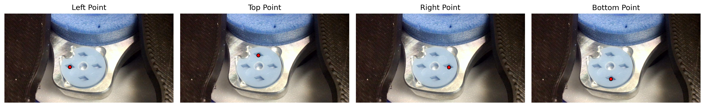
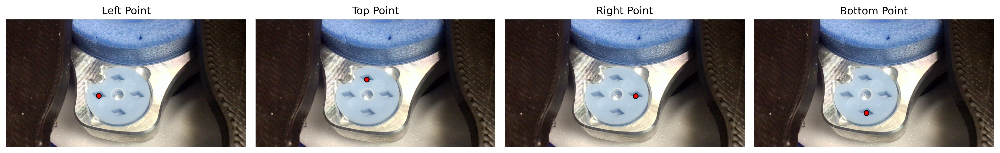
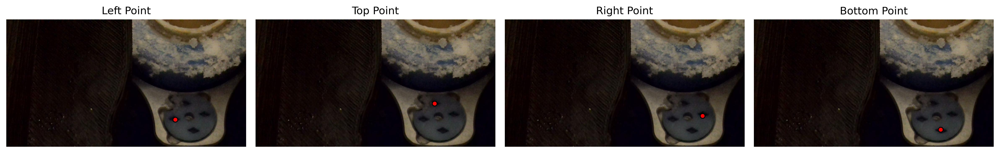
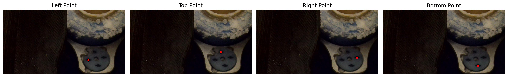
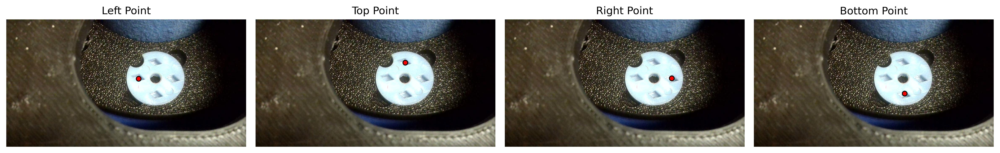
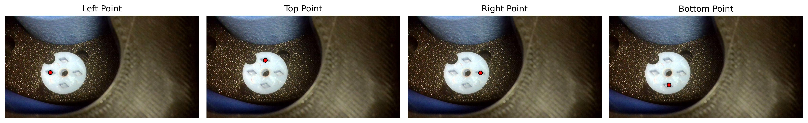
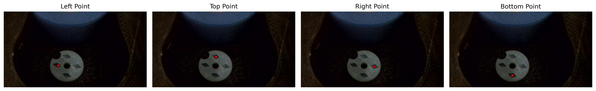

# CryogridNet

A series of neural networks that automatically detect the center coordinates of each slot in a grid box used for CRYO-EM protein freezing. Provided are U-Net models with a MobileNetV2 or DenseNet121 pretrained encoder to predict four slot centers via heatmap regression.

## Installation

If you already have PyTorch with the correct CUDA version installed, simply run:

```bash
pip install -r requirements.txt
```

If you need to install the CUDA 12.4–compatible PyTorch wheels first, run:

```bash
pip install torch==2.6.0+cu124 torchvision==0.21.0+cu124 --extra-index-url https://download.pytorch.org/whl/cu124
pip install -r requirements.txt
```

Alternatively, you can install everything in one command:

```bash
pip install -r requirements.txt --extra-index-url https://download.pytorch.org/whl/cu124
```

## Usage

```bash
python -m train --encoder={mobilenetv2|densenet121|resnet18}
python -m test --encoder={mobilenetv2|densenet121|resnet18}
python -m infer /path/to/image.jpg --encoder={mobilenetv2|densenet121|resnet18}
```

## Overview

This model automates slot center detection in grid boxes for cryo-electron microscopy (CRYO-EM) protein sample preparation. While showing promising results, the project was pivoted to a hardware-based pipeline solution.

## Model Architecture

- **Encoder Options**: MobileNetV2, DenseNet121, or ResNet18 encoder
- **Architecture**: U-Net decoder for spatial localization
- **Output**: 4-channel heatmap prediction (one per slot center)
- **Input**: RGB images resized to 960×512 pixels
- **Detection**: Rhombus-shaped heatmaps for robust center prediction
- **Available on**: [HuggingFace Models](https://huggingface.co/galactixx/gridbox-net)

## Dataset

- **Images**: Grid box photographs with varying conditions
- **Size**: 986 images collected
- **Annotations**: CSV with slot center coordinates (X, Y) for each slot type (L, T, R, B)
- **Format**: Each image contains 4 slot center annotations
- **Split**: Train/validation/test based on grid box positions
- **Available on**: [HuggingFace Datasets](https://huggingface.co/datasets/galactixx/cryogrid-boxes)

```
Position,File,Slot,X,Y
position-000001,img_000001.jpg,B,1186,817
position-000001,img_000001.jpg,L,997,711
```

## Training

- **Loss**: Focal Loss (α=1.0, γ=2.0) for class imbalance
- **Strategy**: Progressive unfreezing of encoder layers
- **Augmentation**: Paired transforms (flips, brightness/contrast)
- **Optimization**: AdamW with EMA and mixed precision

## Results

| Encoder | Average Error (pixels) | Relative Error (%) | Training Epochs | Improvement |
|---------|----------------------|-------------------|-----------------|-------------|
| MobileNetV2 | 6.05 | 0.63 | 34 | - |
| DenseNet121 | 4.21 | 0.44 | 38 | 30.4% better |
| ResNet18 | 4.54 | 0.47 | 30 | 25.0% better |

*Relative error calculated as average error divided by maximum image dimension (960 pixels)*

## Sample Predictions

Below are examples comparing MobileNetV2, DenseNet121, and ResNet18 slot center predictions on test images:

---

### Image 000216


*MobileNetV2 Prediction*


*DenseNet121 Prediction*


*ResNet18 Prediction*

---

### Image 000633


*MobileNetV2 Prediction*


*DenseNet121 Prediction*


*ResNet18 Prediction*

---

### Image 000800


*MobileNetV2 Prediction*


*DenseNet121 Prediction*


*ResNet18 Prediction*

---

## Out-of-Distribution Examples

Below are out-of-distribution (OOD) examples — images that differ from the training/test set in lighting, framing, or content — to show how the models behave on unexpected inputs. Only MobileNetV2 and DenseNet121 OOD predictions are available in the `examples_ood/` folder.

*Note: ResNet18 did not generalize as well on out-of-distribution samples, so ResNet18 OOD predictions are not included here.*

---

### OOD Image 001


*MobileNetV2 Prediction (OOD)*


*DenseNet121 Prediction (OOD)*

---

### OOD Image 002


*MobileNetV2 Prediction (OOD)*


*DenseNet121 Prediction (OOD)*

---

### OOD Image 003


*MobileNetV2 Prediction (OOD)*


*DenseNet121 Prediction (OOD)*

---