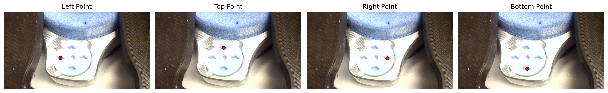
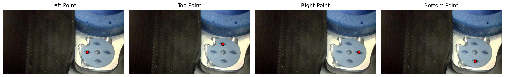
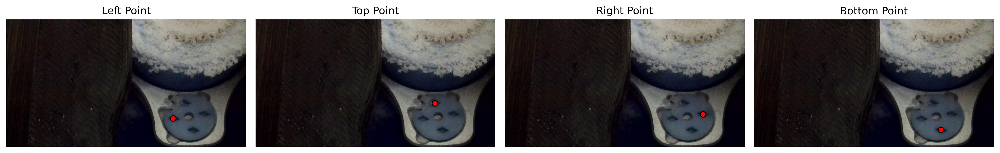
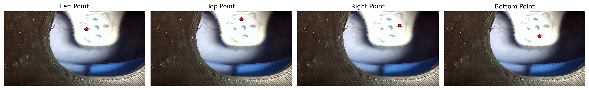
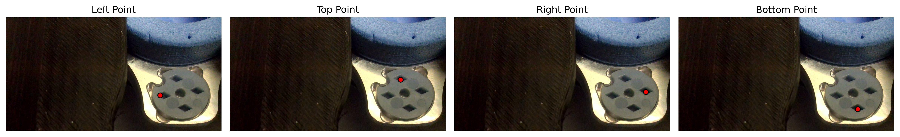

# CryogridNet

A neural network that automatically detects the center coordinates of each slot in a grid box used for CRYO-EM protein freezing. Uses U-Net with MobileNetV2 backbone to predict four slot centers (left, top, right, bottom) via heatmap regression.

## Usage

```bash
python -m train_mobilenetv2  # Training
python -m test_mobilenetv2   # Testing
```

## Overview

This model automates slot center detection in grid boxes for cryo-electron microscopy (CRYO-EM) protein sample preparation. While showing promising results, the project was pivoted to a hardware-based pipeline solution.

## Model Architecture

- **Backbone**: MobileNetV2 encoder
- **Architecture**: U-Net decoder for spatial localization
- **Output**: 4-channel heatmap prediction (one per slot center)
- **Input**: RGB images resized to 960×512 pixels
- **Detection**: Rhombus-shaped heatmaps for robust center prediction
- **Available on**: [HuggingFace Models](https://huggingface.co/galactixx/gridbox-net)

## Dataset

- **Images**: Grid box photographs with varying conditions
- **Annotations**: CSV with slot center coordinates (X, Y) for each slot type (L, T, R, B)
- **Format**: Each image contains 4 slot center annotations
- **Split**: Train/validation/test based on grid box positions
- **Available on**: [HuggingFace Datasets](https://huggingface.co/datasets/galactixx/cryogrid-boxes)

```
Position,File,Slot,X,Y
position-000001,img_000001.jpg,B,1186,817
position-000001,img_000001.jpg,L,997,711
```

## Training

- **Loss**: Focal Loss (α=1.0, γ=2.0) for class imbalance
- **Strategy**: Progressive unfreezing of encoder layers
- **Augmentation**: Paired transforms (flips, brightness/contrast)
- **Optimization**: AdamW with EMA and mixed precision

## Results

- **Dataset**: 986 images collected
- **Test Performance**: 5.379 pixel average error
- **Relative Error**: 0.56% (5.379/960 max dimension of 960×512 image)

## Sample Predictions

Below are examples of the model's slot center predictions on test images:


*Grid box slot center detection - Image 000230*


*Grid box slot center detection - Image 000373*


*Grid box slot center detection - Image 000626*


*Grid box slot center detection - Image 000783*


*Grid box slot center detection - Image 000967*
